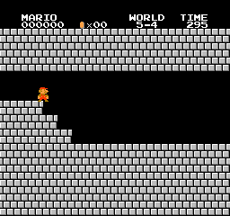

# mario-rl

Reinforcement learning on Super Mario Bros, CPU-only, with the question fixed in advance: **does it learn the
game's mechanics, or memorize levels?** Every headline number is measured on real levels the agent never trains
on. Runs in WSL Ubuntu, because nes-py has to be compiled and gcc is already there.

**[Changelog](#changelog)** · **[Known gaps](#known-gaps)** · **[Predictions](#pre-registered-predictions)** ·
**[Decisions (ADRs)](docs/adr/)** · [Full write-up](docs/mario_rl_science.pdf)

## Changelog

Newest first. The primary metric is **held-out mean x_pos**: 5 real stages the agent never trains on
(`2-1, 3-3, 4-2, 5-4, 7-1`), 10 episodes each, seeds 50000+, randomized start delay, actions sampled from the
policy unless marked greedy. The random-policy baseline under the same protocol is **382**.

| Run | Steps | Held-out x | Train x | Train flags | Held-out flags |
|---|---|---|---|---|---|
| `gen2` (15M) | 15.0M | **671** sampled / **1020** greedy | 1365 | 12.7% | **0.0%** |
| `gen2` (7.8M) | 7.8M | 517 | 1135 | 12.3% | 0.0% |
| `v3b_1h` | 7.8M | **674** | 1440 | 11.8% | 0.0% |
| `gen_1h` | 7.8M | 446 | 757 | 5.0% | 0.0% |
| `ppo_1h_a` (v2) | 1.7M | 582 | 774 | 1 / 220 eps | 0 / 50 eps |
| random baseline | — | 382 | 443 | 0.0% | 0.0% |

### gen2 — generator v2, 15M steps
Procedurally generated terrain patched into the real game's collision buffer: harder layouts (up to 6-tile pits),
walkers up to 2x speed, shorter clock, real pipes and tile themes. 40% of episodes generated, prioritized level
replay on, `ent_coef` raised to 0.02 against the entropy collapse `gen_1h` showed.

Ends level with the best real-levels-only run (671 vs 674, z = -0.1) but **took roughly twice the steps to get
there** — at an equal 7.8M budget it was clearly behind (517 vs 674, z = -3.4). Procedural generation has not yet
paid for itself. Held-out castle 5-4 went from 320 to 1123 with the extra steps, so the earlier "castles need a
castle generator" reading was undertraining, not a missing feature.

### gen_1h — first procedural run (negative result)
75% of episodes on generated terrain. Held-out 446 against 674 for the equivalent real-levels run, with entropy
collapse. Diagnosed as distribution shift from over-weighting generated levels; the guardrails in `gen2` (40%
share, higher entropy bonus) recovered most of it.

### v3 — reward redesign, enemy motion, macro actions
- **reward_version 3:** progress pays only for new ground, with explicit death / hurt / points / coin / flag terms
  instead of the game's clipped reward. This was the single largest gain in the project, and it came from reward
  design rather than tuning.
- **obs_version 3:** per-enemy position and velocity features. Enemy *motion* is invisible in a stack of tile
  frames, so it had to be supplied explicitly.
- **Macro actions (options):** a full-distance jump needs A held 6-8 agent steps, which per-step resampling makes
  improbable. Macros hold the button for a fixed length and are credited with a semi-MDP `gamma^d` discount.
- **18-variant sweep** at 480k steps each: only prioritized level replay separated from noise. Tuning did not
  move the primary metric.

### v2 — PPO on tile grids across real stages
Observation switched from pixels to a 13x16 grid of the game's own tile ids read from RAM, plus the previous
action, speed and air/ground state. 22 training stages, 5 held out. See the [v2 results](#v2-results-a-1-hour-run-not-a-finished-agent) below.

### v1 — Double DQN on 1-1
See [Results: run 1](#results-run-1-dqn_1_1-3m-steps-97-h-on-a-ryzen-7-7800x3d) below.

## Known gaps

Things that are wrong or unmeasured, listed so they are not mistaken for settled:

- **One seed.** Every result in this repo is a single training seed. The reported error bars are episode-level
  variance *within* one seed, which understates true variance. Conclusions that rest on a few standard errors
  may not survive three seeds.
- **The held-out set has been used for model selection.** Checkpoints and settings were chosen after looking at
  held-out scores, so those 5 stages are really a validation set and 671/674 are optimistically biased. There is
  no spare real level: 32 total = 22 train + 5 held out + 5 excluded (water physics, looping mazes).
- **No scripted baseline.** The only floor is a uniform random policy. A scripted "run right and jump on a cycle"
  baseline is not implemented, so it is not known how much of the score the level layout gives away for free.
- **x_pos is not normalized by level length**, so averaging across stages of different lengths silently weights
  the long ones.
- **Sampled vs greedy was not reported until late.** Every historical number above is the sampled policy. On
  `gen2` at 15M, greedy scores 1020 against 671 sampled.
- **No held-out level has ever been completed**, in any run, at any checkpoint.

## Pre-registered predictions

Written down *before* the results existed, so they can fail. A prediction recorded after seeing the numbers is
not a prediction. Each entry fixes its protocol here; if the analysis later departs from it, the departure is
reported rather than quietly substituted.

### P1 — multi-seed replication (not yet run)

> **Prediction:** held-out mean x_pos beats the random baseline (382) in **at least 3 of 3** training seeds.
>
> **Protocol, fixed now:** preset `ppo_1h`, seeds 1, 2 and 3, nothing else changed. Evaluation is the standard
> protocol: 10 episodes per stage, seeds 50000+, randomized start offsets, actions sampled from the policy.
> The primary number is per-seed held-out mean x_pos.
>
> **Falsified if:** any seed fails to beat 382, or the across-seed spread is wide enough that the single-seed
> figures in the changelog cannot be distinguished from seed noise.
>
> **Reported either way**, including the spread — which is the number this project currently cannot quote.

### P2 — previous-action ablation (running)

> **Prediction:** hiding the previous action **lowers** held-out mean x_pos, averaged over 3 seeds.
>
> **Protocol, fixed now:** preset `ppo_ablate_2m`, `obs_prev_action` true vs false, seeds 0, 1 and 2, identical
> 2M-step budget. Reported metrics are the three asked for in review: stall rate, completion (flag) rate and
> distance.
>
> **Falsified if:** the arms land within one standard error of each other, or hiding it helps.
>
> **Honest caveat:** the first of the six runs had finished and been evaluated when this was written. Its
> result had not been looked at. The other five were still running.
>
> **Prior: weak.** An 18-variant sweep previously moved the primary metric exactly once, so "no measurable
> difference" is a live outcome here and would be reported as the result.

## Setup (once, inside WSL)

```bash
curl -LsSf https://astral.sh/uv/install.sh | sh
uv venv --python 3.10 ~/.venvs/mario-rl
source ~/.venvs/mario-rl/bin/activate
cd /mnt/c/Users/17143/mario-rl
uv pip install -r requirements.txt --index-strategy unsafe-best-match
python scripts/probe_env.py   # import test + API behaviour check
```

From PowerShell, prefix any command with the venv wrapper:

```bash
wsl -d Ubuntu --cd /mnt/c/Users/17143/mario-rl -- bash scripts/wsl_run.sh python -m pytest -q tests
```

## Use

```bash
python train.py --preset smoke                            # ~20 s, exercises learn/sync/checkpoint
python train.py --preset full --run-name dqn_1_1          # ~105 steps/s on CPU -> 3M steps is about 8 h
python train.py --resume runs/dqn_1_1/latest.pt --total-steps 5000000
python eval.py runs/dqn_1_1/latest.pt --episodes 30
python eval.py runs/dqn_1_1/latest.pt --stage 2           # held-out stage
```

## Results: run 1 (`dqn_1_1`, 3M steps, ~9.7 h on a Ryzen 7 7800X3D)


*Run 1's agent reaching the flag on 1-1. This is eval episode seed 10005 at epsilon 0.01, replayed exactly
with `python -m scripts.record_gif runs/dqn_1_1/latest.pt --seed 10005`. It is the best case, not the typical
one: 1 of 30 eval episodes reached the flag.*

| Eval (30 episodes, epsilon 0.01) | Mean x_pos | Flag rate |
|---|---|---|
| 1-1 | 1905 / ~3161 | 3% |
| 1-2 (held out) | 386 | 0% |

During training (epsilon 0.1), episodes getting past the 1-1 pipes rose from 24% to 80%, and the flag count went
from 0 to 64 per 250k steps. Main failure: half of eval episodes stall with A held for 100% of the last 150 steps.
SMB needs A released before it can jump again, and frames alone don't show that the button is held.
Next run: add the previous action as a network input.

Full write-up: [docs/mario_rl_report.pdf](docs/mario_rl_report.pdf)

## v2: PPO on tile grids across real stages

Goal: learn Mario's *mechanics*, measured on real levels the agent never trains on.

- **Observation:** a 13x16 grid of the game's own tile ids read from RAM, plus enemies, Mario, the previous
  action (so "A is already held" is visible), speed, and air/ground state. It's the same vocabulary on every
  level, and a future procedural generator can emit it too.
- **Stages:** 22 real stages for training, 5 held out (`2-1, 3-3, 4-2, 5-4, 7-1`). Water levels and looping
  maze castles are excluded.
- **Reward:** game reward + a small coin bonus (about one step of running) + a flag bonus. Both are config values,
  so their effect can be tested with an ablation.
- **Algorithm:** PPO with 12 parallel emulators; truncated episodes bootstrap from the real final observation.

```bash
python train_ppo.py --preset ppo_smoke                       # ~10 s, every code path
python train_ppo.py --preset ppo_1h --run-name ppo_1h_a      # ~1.7M steps, ~53 min at ~540 steps/s
python eval_stages.py runs/ppo_1h_a/latest.pt                # train + held-out stages
python eval_stages.py --random --config runs/ppo_1h_a/config.json
python -m scripts.compare_evals runs/ppo_1h_a/eval_final_all.json runs/ppo_1h_a/eval_random_all.json
python -m scripts.render_tiles --stage 1-1                   # check the RAM tile decoding by eye
```

### v2 results: a 1-hour run, not a finished agent

`ppo_1h_a`: 1.72M steps in 53 minutes (Ryzen 7 7800X3D, CPU only, ~540 steps/s). One training seed.



*Best case, not typical: the single best of 50 held-out eval episodes. Stage 5-4 is a castle the agent never
trained on. It jumps past a fire bar and over lava, reaches x_pos 1763, then dies. On held-out stages the agent
reached the flag in **0 of 50** episodes, and its mean x_pos on 5-4 was 598. Replay:
`python -m scripts.record_gif_ppo runs/ppo_1h_a/latest.pt --stage 5-4 --seed 50008 --out <file>.gif`*

**Eval protocol:** 10 episodes per stage, seeds 50000-50009, random start delay of 0-30 steps, actions
sampled from the policy. The random baseline uses the same protocol. Mean x_pos is how far Mario got; ± is
the standard error; z is the difference divided by its standard error.

| Stages | Trained agent | Random policy | Ratio | Evidence | Flags reached |
|---|---|---|---|---|---|
| Training (22 stages) | **774** | 443 | 1.75x | z = 10.6; clearly ahead on 17 of 22 | 1 / 220 episodes |
| **Held out (5 stages)** | **582** | 382 | **1.52x** | z = 3.9 as a group; clearly ahead on 1 of 5 | **0 / 50** |

| Held-out stage | Trained agent | Random policy | Difference |
|---|---|---|---|
| 2-1 overworld | 666 ± 124 | 554 ± 91 | +112 (within noise) |
| 3-3 athletic | 828 ± 93 | 324 ± 17 | **+504 (z = 5.3)** |
| 4-2 underground | 251 ± 14 | 239 ± 16 | +12 (no difference) |
| 5-4 castle | 598 ± 132 | 387 ± 47 | +211 (within noise) |
| 7-1 overworld | 567 ± 95 | 405 ± 61 | +162 (within noise) |

**What the numbers show:**
- **On levels it trained on, it clearly learned.** It goes 1.75x as far as random and is clearly ahead on 17 of 22 stages.
  During training, mean episode distance rose from 547 to 868 and was still rising when the hour ended. It reached the
  flag 29 times in training (1-1, 3-2, 4-1, 6-1).
- **On levels it never saw, there is an early but weak sign of transfer.** As a group, held-out stages beat random
  (z = 3.9), but only one stage (3-3) is clearly better on its own. Underground 4-2 is no better than random, and no
  held-out level was completed.
- **Checkpoints during the hour were noisy.** Held-out mean x_pos at the 15-, 30- and 45-minute snapshots was 483,
  391 and 466 (5 episodes per stage), against 382 for random. Treat any single mid-run number with caution.
- **Caveats:** one seed; 10 episodes per stage; x_pos is not normalized by level length; the random start delay was
  0-8 steps in training but 0-30 in eval.

Next: longer runs (the training curve had not flattened), 3+ seeds, and progress measured as a fraction of each level.
Raw eval data: [docs/results/ppo_1h_a](docs/results/ppo_1h_a).

## Decisions that aren't obvious from the code

- **Truncation.** Timer expiry kills Mario, so it counts as `terminated`. gym's TimeLimit is 9,999,999 steps and never fires. The only truncation is the no-progress cutoff (`no_progress_steps`), and that is where bootstrapping through `truncated` matters.
- **Rewards.** The env returns the raw skip-frame sum, clipped to ±15 per frame, which gives ±60 per step. The agent stores `reward * reward_scale` (1/15). Logs and eval report raw reward.
- **Buffer.** Each frame is stored once and stacks are rebuilt at sample time: about 706 MB for 100k transitions.
- **Resume.** The checkpoint restores weights, target network, Adam state, step, episode and every RNG. The buffer is restored only if it was saved (`--save-buffer`). Otherwise learning waits until `burnin` new transitions arrive. Changing a learning field on resume needs `--allow-config-change`.
- **Eval.** Each episode gets its own seed, which varies the NOOP-start count and the epsilon RNG. `unique_trajectories` flags a policy that just replays one memorized action sequence.
