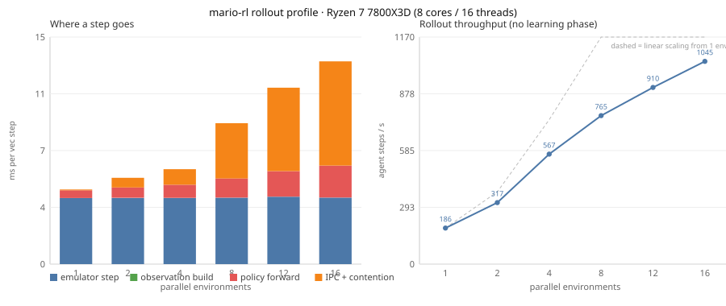
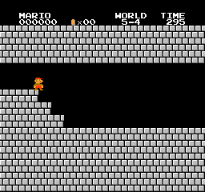

# mario-rl

Reinforcement learning on Super Mario Bros, CPU-only, with the question fixed in advance: **does it learn the
game's mechanics, or memorize levels?** Every headline number is measured on real levels the agent never trains
on. Runs in WSL Ubuntu, because nes-py has to be compiled and gcc is already there.

**[Changelog](#changelog)** · **[Known gaps](#known-gaps)** · **[Predictions](#pre-registered-predictions)** ·
**[Decisions (ADRs)](docs/adr/)** · [Full write-up](docs/mario_rl_science.pdf)

## Changelog

Newest first. The primary metric is **held-out mean x_pos**: 5 real stages the agent never trains on
(`2-1, 3-3, 4-2, 5-4, 7-1`), 10 episodes each, seeds 50000+, randomized start delay, actions sampled from the
policy unless marked greedy. The random-policy baseline under the same protocol is **382**.

| Run | Steps | Held-out x | Train x | Train flags | Held-out flags |
|---|---|---|---|---|---|
| `gen2` (15M) | 15.0M | **671** sampled / **1020** greedy | 1365 | 12.7% | **0.0%** |
| `gen2` (7.8M) | 7.8M | 517 | 1135 | 12.3% | 0.0% |
| `v3b_1h` | 7.8M | **674** | 1440 | 11.8% | 0.0% |
| `gen_1h` | 7.8M | 446 | 757 | 5.0% | 0.0% |
| `ppo_1h_a` (v2) | 1.7M | 582 | 774 | 1 / 220 eps | 0 / 50 eps |
| `ppo_1h`, 3 seeds (P1) | 1.7M | 573 (sd 44) | 943 (sd 25) | 2.1% | 0.0% |
| search winner `t22`, 3 seeds (P3) | 2.0M | 744 (sd 127) | 1423 | 11.1% | 0.0% |
| default `ppo_ablate_2m`, 3 seeds | 2.0M | 662 (sd 86) | 1080 | 2.0% | 0.0% |
| scripted right+jump | — | 412 | 540 | 0.0% | 0.0% |
| random baseline | — | 382 | 443 | 0.0% | 0.0% |

Multi-seed rows are means over seeds. Seed-to-seed spread is about 57 (pooled), so single-seed rows above
them carry roughly ±80 of uncertainty when compared with each other.

Two baselines, because random is a weak floor. The scripted one runs right and presses jump on a fixed cycle
without ever reading the observation, so its score is what the level layout gives away for free. Its cycle
(jump held 8 of every 14 steps) was chosen on **training** stages only, never on the held-out set:

```bash
python eval_stages.py --scripted 14,8 --stages test --episodes 10
```

### Patch notes — September 2026

**Pause, resume and crash-safe checkpoints** (for the planned week-long run)
- `.\scripts\pause.ps1 -Run <name>` saves a checkpoint and idles the run at ~0% CPU; `.\scripts\resume.ps1`
  continues it in place with nothing lost. A reboot while paused resumes from the pause checkpoint.
- Checkpoints are written atomically, so a crash mid-save can no longer corrupt `latest.pt`.
- Stop/restart no longer resets prioritized-level-replay scores; they are saved in the checkpoint.
- Verified: `runs/gen2/latest.pt` (15.0M steps) resumes under today's code with a matching learning hash.
- **Supervisor for long runs:** `.\scripts\start_week.ps1` runs training with automatic restart after a crash
  and evaluates every snapshot on the held-out stages as it appears (low priority, and waits while paused).
  Safe to rerun after a reboot. `.\scripts\week_status.ps1` shows where it is and the held-out curve so far.
- After a crash, log rows written after the last checkpoint are moved to `*_rolled_back.csv`, so the step
  column never repeats. A health check pauses the run if a loss goes non-finite.
- Shakedown before launch: a hard kill mid-run, an automatic restart from the checkpoint, and a pause/resume,
  all checked on a copy of `gen2`. The plan and stop rules are pre-registered as [P4](#p4--the-week-long-run-week1).

**Extra context options** (off by default; not yet trained with)
- `obs_lookahead`: up to 8 extra columns past the screen edge from the game's own buffer, unrendered ones
  masked. Checked against the game: 0.13% of look-ahead cells wrong with masking, 6.7% without.
- `obs_hints`: physics hints plus "if I jump now, where do I land" and a walk-off alarm, using jump distances
  re-measured on two stages (3.3 / 5.2 / 9.7 / 9.8 tiles by takeoff speed).

**Zero-shot language-model player** (`eval_stages.py --llm ollama:<model>`)
- Scores a local model with the standard protocol. On held-out 2-1, one episode each: llama3.2 1B pressed NOOP
  200 times and never moved; llama3.2 3B moved and died to the first goomba at x 306 (random averages 554
  there). Anecdotes, not measurements.

**P3: fail-fast hyperparameter search** — 27 configs by successive halving; the winner did **not** clearly beat
the default on fresh seeds (744 vs 662, t = 0.93). The one consistent pattern was a lower discount factor
(gamma 0.95 best, 0.995 worst). The winner reached the flag on 11% of training-level episodes against the
default's 2% at the same budget, with no held-out gain: faster memorization, not better play. Details in
[P3 result](#p3-result-the-fail-fast-search).

**Measurement and method** — multi-seed replication (P1 held, 3/3 seeds beat both baselines), the
previous-action ablation (P2: no measurable effect), seed-level variance (pooled SD ≈ 57), a scripted baseline,
greedy-vs-sampled reporting, the start-delay comparison, level-length normalization from the emulator, a
throughput profile, run manifests, a determinism test, a Lost Levels test set (16 stages verified), and six ADRs.

### gen2 — generator v2, 15M steps
Procedurally generated terrain patched into the real game's collision buffer: harder layouts (up to 6-tile pits),
walkers up to 2x speed, shorter clock, real pipes and tile themes. 40% of episodes generated, prioritized level
replay on, `ent_coef` raised to 0.02 against the entropy collapse `gen_1h` showed.

Ends level with the best real-levels-only run (671 vs 674, z = -0.1) but **took roughly twice the steps to get
there** — at an equal 7.8M budget it was clearly behind (517 vs 674, z = -3.4). Procedural generation has not yet
paid for itself. Held-out castle 5-4 went from 320 to 1123 with the extra steps, so the earlier "castles need a
castle generator" reading was undertraining, not a missing feature.

### gen_1h — first procedural run (negative result)
75% of episodes on generated terrain. Held-out 446 against 674 for the equivalent real-levels run, with entropy
collapse. Diagnosed as distribution shift from over-weighting generated levels; the guardrails in `gen2` (40%
share, higher entropy bonus) recovered most of it.

### v3 — reward redesign, enemy motion, macro actions
- **reward_version 3:** progress pays only for new ground, with explicit death / hurt / points / coin / flag terms
  instead of the game's clipped reward. This was the single largest gain in the project, and it came from reward
  design rather than tuning.
- **obs_version 3:** per-enemy position and velocity features. Enemy *motion* is invisible in a stack of tile
  frames, so it had to be supplied explicitly.
- **Macro actions (options):** a full-distance jump needs A held 6-8 agent steps, which per-step resampling makes
  improbable. Macros hold the button for a fixed length and are credited with a semi-MDP `gamma^d` discount.
- **18-variant sweep** at 480k steps each: only prioritized level replay separated from noise. Tuning did not
  move the primary metric.

### v2 — PPO on tile grids across real stages
Observation switched from pixels to a 13x16 grid of the game's own tile ids read from RAM, plus the previous
action, speed and air/ground state. 22 training stages, 5 held out. See the [v2 results](#v2-results-a-1-hour-run-not-a-finished-agent) below.

### v1 — Double DQN on 1-1
See [Results: run 1](#results-run-1-dqn_1_1-3m-steps-97-h-on-a-ryzen-7-7800x3d) below.

## Known gaps

Things that are wrong or unmeasured, listed so they are not mistaken for settled:

- **One seed, and now we know what that costs.** Every result in the changelog is a single training seed, with
  error bars from episode-level variance *within* that seed (±46). Nine runs across three configurations now
  put the seed-level SD at about **57** (pooled, df 6), so the standard error on a difference between two
  single-seed runs is about **80**. Differences smaller than that are not effects, which covers several
  comparisons in the changelog. Same-weights comparisons (greedy vs sampled, start delay) are unaffected.
  See [how much the seed matters](#how-much-does-the-seed-matter-revising-the-previous-estimate).
- **The held-out set has been used for model selection.** Checkpoints and settings were chosen after looking at
  held-out scores, so those 5 stages are really a validation set and 671/674 are optimistically biased. There is
  no spare level in SMB itself (32 total = 22 train + 5 held out + 5 excluded), but Lost Levels worlds 1–4 give
  16 untouched stages, and `scripts/probe_lost_levels.py` verified the RAM map on all 16. They are the intended
  final test set; nothing has been evaluated on them yet.
- **The scripted baseline beats the agent on one held-out level.** On 7-1 the scripted policy reaches 728 while
  the sampled agent reaches 609 (the greedy agent reaches 861). The scripted policy is also deterministic, so
  three of the five held-out stages produced a single unique trajectory: those per-stage numbers are precise but
  are not five independent samples.
- **Length normalization only covers stages the agent has finished.** `progress_fraction` uses flagpole positions
  measured from the emulator ([ADR-0003](docs/adr/0003-measure-stage-lengths-from-the-emulator.md)), 7 of 32 so
  far. No held-out stage has been finished, so held-out results are still reported in raw x_pos.
- **Sampled vs greedy was not reported until late.** Every historical number above is the sampled policy. On
  `gen2` at 15M, greedy scores 1020 against 671 sampled.
- **No held-out level has ever been completed**, in any run, at any checkpoint.

## Throughput: where a rollout step actually goes



Fixed 300 timed steps per env after 30 warmup steps, `ppo_full` config, Ryzen 7 7800X3D (8 physical cores, 16
threads). Emulator and observation-build costs are measured in-process on a single env; `ipc_contention` is a
**residual** (`vec_step − emulator − obs_build − policy`), so it absorbs pickling, pipe traffic, scheduler
queueing and core contention. Raw CSV: [docs/results/bench_envs.csv](docs/results/bench_envs.csv).

| envs | steps/s | emulator | obs build | policy fwd | IPC + contention |
|---|---|---|---|---|---|
| 1 | 186 | 4.31 ms (88%) | 0.005 ms | 0.50 ms (10%) | 0.05 ms (1%) |
| 2 | 317 | 4.32 ms (77%) | 0.006 ms | 0.68 ms (12%) | 0.63 ms (11%) |
| 4 | 567 | 4.32 ms (70%) | 0.005 ms | 0.86 ms (14%) | 1.02 ms (16%) |
| 8 | 765 | 4.33 ms (47%) | 0.005 ms | 1.26 ms (14%) | 3.60 ms (39%) |
| 12 | 911 | 4.40 ms (38%) | 0.005 ms | 1.67 ms (14%) | 5.44 ms (47%) |
| 16 | 1045 | 4.34 ms (33%) | 0.005 ms | 2.09 ms (16%) | 6.80 ms (51%) |

**The bottleneck changes identity at the physical core count.** Up to 4 envs the emulator dominates at 70–88%.
Beyond 8 — the number of physical cores — IPC and contention overtake it, reaching **51% at 16 envs**, while the
emulator stays flat at ~4.3 ms because it is irreducible per-env serial work. The crossover falls between 8 and
12 envs, exactly where workers start competing for cores.

Three things worth naming:

- **The observation build is free.** 0.005 ms against the emulator's 4.3 ms — about 0.1%, three orders of
  magnitude apart. Decoding RAM into the tile grid costs nothing, which retires any concern that the tile
  observation is expensive (see [ADR-0001](docs/adr/0001-tile-grid-from-ram-instead-of-pixels.md)).
- **Scaling is sublinear from 4 envs on.** Per-env efficiency falls from 186 steps/s at 1 env to 65 at 16, about
  35%. Doubling 8 → 16 buys 1.37x, not 2x.
- **12 envs is not obviously the right choice.** 16 envs gives 1045 against 911 steps/s, roughly 15% more
  rollout throughput. Whether that survives end to end is a separate question: this measures the rollout phase
  only, and more envs also enlarge the learning batch. Training currently runs ~630 steps/s at 12 envs
  *including* the learning phase, which is about 37% of wall time. Testing 16 envs end to end is the follow-up.

```bash
python -m scripts.bench_envs --n-envs 1,2,4,8,12,16 --steps 300   # ~4 min, needs an idle machine
python -m scripts.bench_chart                                     # re-render the SVG
```

## Pre-registered predictions

Written down *before* the results existed, so they can fail. A prediction recorded after seeing the numbers is
not a prediction. Each entry fixes its protocol here; if the analysis later departs from it, the departure is
reported rather than quietly substituted.

### P1 — multi-seed replication (not yet run)

> **Prediction:** held-out mean x_pos beats the random baseline (382) in **at least 3 of 3** training seeds.
>
> **Protocol, fixed now:** preset `ppo_1h`, seeds 1, 2 and 3, nothing else changed. Evaluation is the standard
> protocol: 10 episodes per stage, seeds 50000+, randomized start offsets, actions sampled from the policy.
> The primary number is per-seed held-out mean x_pos.
>
> **Falsified if:** any seed fails to beat 382, or the across-seed spread is wide enough that the single-seed
> figures in the changelog cannot be distinguished from seed noise.
>
> **Reported either way**, including the spread — which is the number this project currently cannot quote.
>
> **Outcome: held, 3 of 3.** See [below](#p1-result-multi-seed-replication).

### P2 — previous-action ablation (running)

> **Prediction:** hiding the previous action **lowers** held-out mean x_pos, averaged over 3 seeds.
>
> **Protocol, fixed now:** preset `ppo_ablate_2m`, `obs_prev_action` true vs false, seeds 0, 1 and 2, identical
> 2M-step budget. Reported metrics are the three asked for in review: stall rate, completion (flag) rate and
> distance.
>
> **Falsified if:** the arms land within one standard error of each other, or hiding it helps.
>
> **Honest caveat:** the first of the six runs had finished and been evaluated when this was written. Its
> result had not been looked at. The other five were still running.
>
> **Prior: weak.** An 18-variant sweep previously moved the primary metric exactly once, so "no measurable
> difference" is a live outcome here and would be reported as the result.
>
> **Outcome: no measurable effect.** See [below](#p2-result-the-previous-action-ablation). The direction
> matched, the magnitude did not survive contact with seed noise, and the falsification threshold written
> above turned out to be too lenient — that is recorded rather than quietly reinterpreted.

### P3 — fail-fast hyperparameter search

> **Prediction:** the successive-halving winner, retrained on seeds 0, 1 and 2 at 2M steps, beats the default
> config on the same seeds and budget (`ppo_ablate_2m`, held-out mean 661.9) with **t ≥ 2**.
>
> **Protocol, fixed now:** `python -m scripts.sha_search` — 27 configs (trial 0 is the default), eta 3, rungs at
> 250k / 750k / 2.25M steps, training seed 100, selection on held-out mean x_pos with 10 / 15 / 20 eval episodes
> per stage. Then `--confirm`: the winner retrained on seeds 0–2, which the search never used, compared against
> the existing default runs in `docs/results/prev_action_ablation/prevact_true_s*`. Only optimizer settings
> and PLR are searched; reward, observation, actions and training `noop_max` are fixed
> ([ADR-0006](docs/adr/0006-successive-halving-with-seed-confirmation.md)).
>
> **Falsified if:** t < 2 in the confirmation. The search's own leaderboard does not count as evidence: the best
> of 27 noisy single-seed scores is inflated by luck.
>
> **Threshold is t ≥ 2, not "one standard error"**, because P2 showed the looser rule was too easy to pass.
>
> **Prior: weak.** The 18-variant sweep moved the primary metric once, and with seed SD ≈ 57 most tuning effects
> will be smaller than the noise. The expected outcome is a winner that looks good in the search and does not
> clearly survive confirmation. That would be reported as the result.
>
> **Outcome: falsified, t = 0.93** — the expected outcome. See [below](#p3-result-the-fail-fast-search).

### P4 — the week-long run (`week1`)

> **Prediction:** continuing `gen2` from 15.0M to **300M steps** raises held-out mean x_pos, judged on the
> **last three checkpoints of each run** with a Welch t-test, **t ≥ 2**. The `gen2` side is fixed now:
> 12M / 14M / 15M score **506.6 / 718.9 / 670.5** (mean 632.0, SD 111.2). The `week1` side is its 280M,
> 290M and 300M snapshots.
>
> **Why three checkpoints, not the final one:** checkpoints of the same run differ far more than one
> evaluation's noise. `gen2`'s last three spread with SD 111, while each evaluation's own standard error is
> 28–51; the shakedown's snapshots 200k steps apart scored 782.7, 663.7 and 631.9. A single final snapshot
> would mostly measure where the policy happened to be that hour. If `week1`'s checkpoints vary as much as
> `gen2`'s, t ≥ 2 needs a gain of roughly 180.
>
> **Why this is worth a week:** `gen2` was still climbing (517 at 7.8M → 671 at 15M), and the procedural-level
> literature (CoinRun, Procgen) reports generalization appearing at around 200M steps, 13× what any run here
> has had.
>
> **Protocol, fixed now:** `gen2` resumed unchanged (learning hash `ffbd6fc11b73`, same reward, same training
> `noop_max`), a snapshot every 10M steps, each evaluated on the held-out stages as it appears with the
> standard protocol (10 episodes per stage, seeds 50000+, start delay 0–30, sampled actions). The final
> checkpoint gets the same evaluation on all 27 stages. Measured throughput in the shakedown: 613–648
> steps/s, so the 285M remaining steps are about 5.1–5.4 days before pauses and evaluations.
>
> **Stop rules, fixed now:**
> - automatic: a non-finite loss pauses the run (`ALERT.txt`); three crashes within 30 minutes stop restarts.
> - futility check at 60M: the same test on the 40M / 50M / 60M snapshots. If it is not t ≥ 2 by then,
>   continuing is a choice, not the default. This check can only stop the run, never declare success: it is
>   an extra look at the data, and extra looks inflate false positives.
>
> **Falsified if:** t < 2 at 300M. **Caveats:** one seed, so a success shows this run improved, not that the
> recipe reliably does. And the held-out stages have been used to choose between runs before, so they are
> closer to a validation set than a clean test set. Baseline evaluations:
> [`docs/results/p4_baseline/`](docs/results/p4_baseline/) (the 15M one reproduces the earlier 670.54 exactly
> under today's code).

## P3 result: the fail-fast search

27 configs, 27 → 9 → 3 → 1, about 10 hours including evaluation. Full state and the confirmation evals are in
[docs/results/sha](docs/results/sha).

**The winner did not clearly beat the default.** Trial `t22` (lr 5.2e-4, ent_coef 0.009, gamma 0.95,
gae_lambda 0.9, epochs 3, minibatches 8, vf_coef 0.25) retrained on seeds the search never used:

| | seed 0 | seed 1 | seed 2 | mean | sd |
|---|---|---|---|---|---|
| search winner `t22` | 777.8 | 604.2 | 850.9 | **744.3** | 126.7 |
| default | 585.6 | 754.6 | 645.6 | **661.9** | 85.7 |

+82.4, SE 88.3, **t = 0.93**. The winner's 3-seed mean is the highest held-out figure at 2M steps in this repo,
and it still cannot be told apart from the default. With per-arm spread this large, resolving a difference of
~80 would take about **14 seeds per arm** — roughly a day of compute for one comparison on this machine.

**The search mostly ranked noise, and the data shows it.** The eventual winner survived the first cut at rank
9 of 27, **5.7 points** above the first eliminated config, against eval noise of about ±46. Between rung 0 and
rung 1 the order of the nine survivors reshuffled almost completely: the two finalists that did best had ranked
7th and 9th, and the 4th-ranked config fell to last. At 250k steps the ranking carried little information.
ADR-0006 accepted that early eliminations would be partly random; this measured how random.

**The one pattern that held up across all 27 trials is gamma**, and it was not a surprise. A lower discount
factor did better at every level:

| gamma | trials | rung-0 mean | reached rung 1 | reached rung 2 |
|---|---|---|---|---|
| 0.95 | 5 | 453.9 | 3 | 2 |
| 0.97 | 6 | 437.6 | 3 | 1 |
| 0.99 (default) | 8 | 428.0 | 3 | 0 |
| 0.995 | 8 | 399.1 | **0** | 0 |

None of the eight gamma = 0.995 configs survived the first cut, and all three finalists used 0.95 or 0.97. This matches a hypothesis written down *before* the search: at gamma 0.99 the
value horizon is about 100 agent steps, roughly 60 tiles of level, while the observation shows about 10 tiles
ahead, so the critic can only fill the gap on levels it has memorized. A shorter horizon should generalize
better. No other setting showed a trend of comparable size.

It is still a lead, not a result: every trial varied every parameter at once, each ran one seed, and the
pattern is read from a search that was not designed to measure it. **The clean test is a gamma-only
ablation** — 0.99 vs 0.95, everything else default, several seeds — which is the one follow-up this search
earned.

What the search did deliver is the fail-fast part: it ruled out a region cheaply. Very long horizons
(gamma 0.995) are consistently worse here, and it took about 7 minutes per config to learn that, not a day.

## P1 result: multi-seed replication

Preset `ppo_1h`, seeds 1, 2 and 3, standard evaluation. Raw JSON in [docs/results/seeds](docs/results/seeds).

| seed | held-out x | train x | held-out flags | stall |
|---|---|---|---|---|
| 1 | 586.1 | 922.4 | 0.000 | 0.000 |
| 2 | 608.4 | 970.8 | 0.000 | 0.040 |
| 3 | 523.3 | 936.0 | 0.000 | 0.000 |
| **mean** | **572.6** (sd 44.1) | **943.1** (sd 25.0) | 0.000 | |

**P1 held: 3 of 3 seeds beat the random baseline of 382**, and all three also beat the scripted baseline of
412. The held-out advantage over both floors replicates across seeds. Against the scripted baseline the
across-seed margin is 161 with a standard error of 25, so this one is not close.

The historical single-seed `ppo_1h_a` figures (582 held-out, 774 train) agree with these seeds on held-out but
not on train. That run predates several environment and throughput fixes, so it is not a clean fourth sample
and is not pooled here.

Still zero held-out flags, in all three seeds.

### How much does the seed matter? (revising the previous estimate)

The previous-action ablation gave a seed-level SD of 85.7 and this README concluded that single-seed
differences below about 170 could not be called effects. **That was an overreach from one arm of one
experiment.** There are now three independent estimates, each from 3 seeds:

| configuration | seed-level SD |
|---|---|
| `ppo_ablate_2m`, previous action visible | 85.7 |
| `ppo_ablate_2m`, previous action hidden | 19.3 |
| `ppo_1h`, seeds 1–3 | 44.1 |

Pooling them gives **SD ≈ 57 with 6 degrees of freedom** — a far better estimate than any single one, and the
number to use. An SD from only 3 samples is very imprecise, which is exactly why the 85.7 should not have been
quoted alone.

Comparing two *single-seed* runs, the standard error of the difference is about **80**. Applied to the
changelog:

| comparison | difference | vs SE 80 | reading |
|---|---|---|---|
| PLR's training gain | +44 | 0.6 | not an effect |
| `gen2` vs `v3b` held-out at 7.8M | −158 | 2.0 | borderline, not the z = −3.4 previously claimed |
| `gen2` 671 vs `v3b` 674 at 15M | −3 | 0.04 | never precise enough to be a "tie" |

Two comparisons are **unaffected**, because they reuse the same weights and so carry no seed variance at all —
only episode noise: greedy vs sampled (+349) and the start-delay mismatch (+121). Those stand.

## P2 result: the previous-action ablation

Six runs, `ppo_ablate_2m`, 2M steps each, identical settings, three seeds per arm. Held-out mean x_pos under
the standard protocol. Raw eval JSON in [docs/results/prev_action_ablation](docs/results/prev_action_ablation).

| arm | s0 | s1 | s2 | mean | sd |
|---|---|---|---|---|---|
| previous action **visible** | 585.6 | 754.6 | 645.6 | **661.9** | 85.7 |
| previous action **hidden** | 586.5 | 592.5 | 622.6 | **600.5** | 19.3 |

Difference **+61.4** in favour of visible, SE of the difference **50.7**, **t = 1.21**. That is not
distinguishable from zero.

**The honest call is "no measurable effect."** The pre-registered falsification rule said "within one standard
error", and 61.4 is a hair outside 50.7 — so on a literal reading the prediction survives. It should not be
scored that way: one standard error is a ~68% band, not a significance test, and t = 1.21 is roughly a 3-in-10
result under the null. The threshold was written too leniently. Recording that is the point of writing it down
beforehand.

**Why the effect is small is the more useful finding.** Stall rate was **0.000 in five of the six runs** (0.040
in the other). The previous action was added in v2 to fix v1's dominant failure, where half of eval episodes
ended with A held for 100% of the last 150 steps. At 2M steps with the v3 reward and this action set, that
failure does not occur in either arm. You cannot measure the benefit of a fix for a problem that no longer
happens — the reward redesign and macro actions appear to have removed it independently. Re-running this
ablation on the v2 reward, where stalls were common, would be the experiment that actually tests the original
claim.

Neither arm reached a flag on any held-out level, in any seed.

### The number this project could not previously quote

**Seed-level spread is 85.7** on the visible arm — nearly double the ±46 episode-level standard error every
prior comparison in this README was judged against.

*Revised after P1:* this single estimate was too high and was quoted too confidently. Pooling all nine runs
gives SD ≈ 57; see [how much the seed matters](#how-much-does-the-seed-matter-revising-the-previous-estimate)
for the corrected analysis and what it does to the changelog. The direction of the conclusion is unchanged —
several single-seed comparisons are not effects — but the threshold is about 80, not 170.

## The start-delay mismatch

Training uses a random start delay of 0–8 idle steps; evaluation uses 0–30. The gap is deliberate — every reset
idles one emulator while the other 11 wait, so a long delay at training time costs about 35% of rollout
throughput (628 vs 990 steps/s measured). Evaluation has no such constraint and wants more start variety.

The same checkpoint (`gen2`, 15M), 10 episodes per held-out stage, evaluated both ways:

| held-out stage | 0–8 starts | 0–30 starts | difference |
|---|---|---|---|
| 2-1 | 818.7 | 801.8 | −17 |
| 3-3 | 498.9 | 498.9 | 0 |
| 4-2 | 312.0 | 320.4 | +8 |
| 5-4 | 1152.3 | 1122.7 | −30 |
| **7-1** | **1178.7** | **608.9** | **−570** |
| **mean** | **792.1** | **670.5** | **−121** |

**Which is the fair number: 0–30.** Both baselines (random 382, scripted 412) were measured under it, and a
policy that only works from a narrow band of start phases has not generalized — so the harder protocol is the
honest one, and every headline figure in this README uses it.

But the 121-point gap is itself a result, not just a protocol detail. Almost all of it is one stage: 7-1 nearly
doubles when the start distribution matches training. Both columns are 10 distinct trajectories, so this is not
a sampling artifact. Sensitivity to *when* the episode starts is what memorized timing looks like, as opposed
to reacting to what is on screen — which is the same conclusion the train/held-out gap points at.

Raw data: [docs/results/noop_mismatch](docs/results/noop_mismatch).

```bash
python eval_stages.py runs/gen2/latest.pt --stages test --episodes 10 --noop-max 8
```

## Setup (once, inside WSL)

```bash
curl -LsSf https://astral.sh/uv/install.sh | sh
uv venv --python 3.10 ~/.venvs/mario-rl
source ~/.venvs/mario-rl/bin/activate
cd /mnt/c/Users/17143/mario-rl
uv pip install -r requirements.txt --index-strategy unsafe-best-match
python scripts/probe_env.py   # import test + API behaviour check
```

From PowerShell, prefix any command with the venv wrapper:

```bash
wsl -d Ubuntu --cd /mnt/c/Users/17143/mario-rl -- bash scripts/wsl_run.sh python -m pytest -q tests
```

## Use

```bash
python train.py --preset smoke                            # ~20 s, exercises learn/sync/checkpoint
python train.py --preset full --run-name dqn_1_1          # ~105 steps/s on CPU -> 3M steps is about 8 h
python train.py --resume runs/dqn_1_1/latest.pt --total-steps 5000000
python eval.py runs/dqn_1_1/latest.pt --episodes 30
python eval.py runs/dqn_1_1/latest.pt --stage 2           # held-out stage
```

## Results: run 1 (`dqn_1_1`, 3M steps, ~9.7 h on a Ryzen 7 7800X3D)


*Run 1's agent reaching the flag on 1-1. This is eval episode seed 10005 at epsilon 0.01, replayed exactly
with `python -m scripts.record_gif runs/dqn_1_1/latest.pt --seed 10005`. It is the best case, not the typical
one: 1 of 30 eval episodes reached the flag.*

| Eval (30 episodes, epsilon 0.01) | Mean x_pos | Flag rate |
|---|---|---|
| 1-1 | 1905 / ~3161 | 3% |
| 1-2 (held out) | 386 | 0% |

During training (epsilon 0.1), episodes getting past the 1-1 pipes rose from 24% to 80%, and the flag count went
from 0 to 64 per 250k steps. Main failure: half of eval episodes stall with A held for 100% of the last 150 steps.
SMB needs A released before it can jump again, and frames alone don't show that the button is held.
Next run: add the previous action as a network input.

Full write-up: [docs/mario_rl_report.pdf](docs/mario_rl_report.pdf)

## v2: PPO on tile grids across real stages

Goal: learn Mario's *mechanics*, measured on real levels the agent never trains on.

- **Observation:** a 13x16 grid of the game's own tile ids read from RAM, plus enemies, Mario, the previous
  action (so "A is already held" is visible), speed, and air/ground state. It's the same vocabulary on every
  level, and a future procedural generator can emit it too.
- **Stages:** 22 real stages for training, 5 held out (`2-1, 3-3, 4-2, 5-4, 7-1`). Water levels and looping
  maze castles are excluded.
- **Reward:** game reward + a small coin bonus (about one step of running) + a flag bonus. Both are config values,
  so their effect can be tested with an ablation.
- **Algorithm:** PPO with 12 parallel emulators; truncated episodes bootstrap from the real final observation.

```bash
python train_ppo.py --preset ppo_smoke                       # ~10 s, every code path
python train_ppo.py --preset ppo_1h --run-name ppo_1h_a      # ~1.7M steps, ~53 min at ~540 steps/s
python eval_stages.py runs/ppo_1h_a/latest.pt                # train + held-out stages
python eval_stages.py --random --config runs/ppo_1h_a/config.json
python -m scripts.compare_evals runs/ppo_1h_a/eval_final_all.json runs/ppo_1h_a/eval_random_all.json
python -m scripts.render_tiles --stage 1-1                   # check the RAM tile decoding by eye
```

### v2 results: a 1-hour run, not a finished agent

`ppo_1h_a`: 1.72M steps in 53 minutes (Ryzen 7 7800X3D, CPU only, ~540 steps/s). One training seed.



*Best case, not typical: the single best of 50 held-out eval episodes. Stage 5-4 is a castle the agent never
trained on. It jumps past a fire bar and over lava, reaches x_pos 1763, then dies. On held-out stages the agent
reached the flag in **0 of 50** episodes, and its mean x_pos on 5-4 was 598. Replay:
`python -m scripts.record_gif_ppo runs/ppo_1h_a/latest.pt --stage 5-4 --seed 50008 --out <file>.gif`*

**Eval protocol:** 10 episodes per stage, seeds 50000-50009, random start delay of 0-30 steps, actions
sampled from the policy. The random baseline uses the same protocol. Mean x_pos is how far Mario got; ± is
the standard error; z is the difference divided by its standard error.

| Stages | Trained agent | Random policy | Ratio | Evidence | Flags reached |
|---|---|---|---|---|---|
| Training (22 stages) | **774** | 443 | 1.75x | z = 10.6; clearly ahead on 17 of 22 | 1 / 220 episodes |
| **Held out (5 stages)** | **582** | 382 | **1.52x** | z = 3.9 as a group; clearly ahead on 1 of 5 | **0 / 50** |

| Held-out stage | Trained agent | Random policy | Difference |
|---|---|---|---|
| 2-1 overworld | 666 ± 124 | 554 ± 91 | +112 (within noise) |
| 3-3 athletic | 828 ± 93 | 324 ± 17 | **+504 (z = 5.3)** |
| 4-2 underground | 251 ± 14 | 239 ± 16 | +12 (no difference) |
| 5-4 castle | 598 ± 132 | 387 ± 47 | +211 (within noise) |
| 7-1 overworld | 567 ± 95 | 405 ± 61 | +162 (within noise) |

**What the numbers show:**
- **On levels it trained on, it clearly learned.** It goes 1.75x as far as random and is clearly ahead on 17 of 22 stages.
  During training, mean episode distance rose from 547 to 868 and was still rising when the hour ended. It reached the
  flag 29 times in training (1-1, 3-2, 4-1, 6-1).
- **On levels it never saw, there is an early but weak sign of transfer.** As a group, held-out stages beat random
  (z = 3.9), but only one stage (3-3) is clearly better on its own. Underground 4-2 is no better than random, and no
  held-out level was completed.
- **Checkpoints during the hour were noisy.** Held-out mean x_pos at the 15-, 30- and 45-minute snapshots was 483,
  391 and 466 (5 episodes per stage), against 382 for random. Treat any single mid-run number with caution.
- **Caveats:** one seed; 10 episodes per stage; x_pos is not normalized by level length; the random start delay was
  0-8 steps in training but 0-30 in eval.

Next: longer runs (the training curve had not flattened), 3+ seeds, and progress measured as a fraction of each level.
Raw eval data: [docs/results/ppo_1h_a](docs/results/ppo_1h_a).

## Decisions that aren't obvious from the code

- **Truncation.** Timer expiry kills Mario, so it counts as `terminated`. gym's TimeLimit is 9,999,999 steps and never fires. The only truncation is the no-progress cutoff (`no_progress_steps`), and that is where bootstrapping through `truncated` matters.
- **Rewards.** The env returns the raw skip-frame sum, clipped to ±15 per frame, which gives ±60 per step. The agent stores `reward * reward_scale` (1/15). Logs and eval report raw reward.
- **Buffer.** Each frame is stored once and stacks are rebuilt at sample time: about 706 MB for 100k transitions.
- **Resume.** The checkpoint restores weights, target network, Adam state, step, episode and every RNG. The buffer is restored only if it was saved (`--save-buffer`). Otherwise learning waits until `burnin` new transitions arrive. Changing a learning field on resume needs `--allow-config-change`.
- **Eval.** Each episode gets its own seed, which varies the NOOP-start count and the epsilon RNG. `unique_trajectories` flags a policy that just replays one memorized action sequence.
